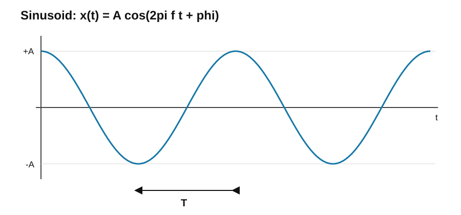
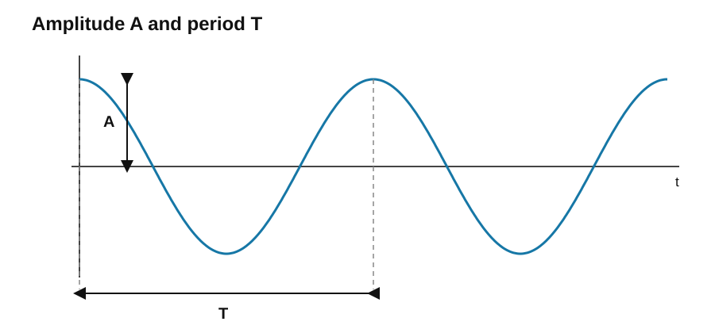

# 1. 정현파와 기본 요소

## 1.1 정현파(Sinusoid)

정현파는 `sin` 또는 `cos` 함수 형태로 주기적으로 반복되는 신호임. 등속 원운동하는 점의 한 축 방향 위치를 시간에 대해 나타내면 정현파가 됨.

정현파는 다음 세 요소에 의해 완전히 결정됨.

$$
x(t)=A\cos(\omega t+\phi)
$$

- $A$ : 진폭(amplitude)
- $\phi$ : 위상(phase)
- $\omega$ : 각주파수(angular frequency)

또한

$$
\omega=2\pi f
$$

이므로

$$
x(t)=A\cos(2\pi ft+\phi)
$$

로도 표현함.

정현파를 원운동으로 생각하면 원의 반지름이 $A$, 회전각이 $\omega t+\phi$에 해당함. 회전점의 수평축 좌표를 보면 cos, 수직축 좌표를 보면 sin으로 볼 수 있으며 두 표현 사이에는 $90^\circ$, 즉 $\pi/2$ rad의 위상차가 존재함.

### cos를 기준으로 표현하는 이유

- $\phi=0$일 때 $x(0)=A$가 되어 초기값과 진폭의 관계를 바로 확인 가능함.
- 오일러 공식에서 복소지수의 실수부가 cos이므로 실신호 표현에 편리함.
- cos는 짝함수이므로 대칭성을 이용한 수학적 계산이 간단함.
- sin은 cos를 $90^\circ$ 이동한 형태로 나타낼 수 있음.

$$
\sin\theta=\cos\left(\theta-\frac{\pi}{2}\right)
$$

따라서 sin과 cos는 본질적으로 같은 정현파이며, 위상 기준만 다른 표현임.

---

## 1.2 진폭(Amplitude)

진폭은 정현파가 변화할 수 있는 값의 크기 또는 범위를 결정함.

$$
x(t)=A\cos(\omega t+\phi)
$$

에서 최대값은 $+A$, 최소값은 $-A$임.

$$
-A\le x(t)\le A
$$

$A$가 커지면 파형의 세로 크기가 커지고, 작아지면 세로 크기가 작아짐. 진폭이 달라져도 주기와 주파수가 동일하면 반복 속도는 변하지 않음.

---

## 1.3 위상(Phase)

위상은 정현파가 한 주기 중 어느 위치에서 시작하는지를 각도로 나타낸 값임.

$$
x(t)=A\cos(\omega t+\phi)
$$

에서 $\phi$가 위상임.

위상 변화는 진폭이나 파형의 기본 모양을 바꾸지 않고 시간축에서 파형의 위치만 좌우로 이동시킴.

- 시간적으로 앞서 있음 → 선행 위상
- 시간적으로 뒤져 있음 → 지연 위상

$\phi=0$이면 cos 신호는 $t=0$에서 최대값 $A$로 시작함.

---

## 1.4 주기(Period)

주기 $T$는 정현파가 같은 파형을 다시 반복하기까지 걸리는 최소 시간임. 단위는 초(s)를 사용함.

한 최대점에서 다음 최대점까지의 시간, 또는 같은 방향의 영점 통과점에서 다음 같은 영점 통과점까지의 시간이 한 주기임.

$$
T=\frac{1}{f}
$$

