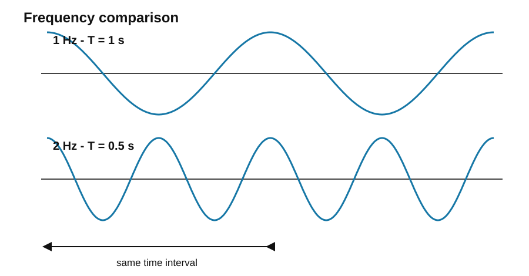
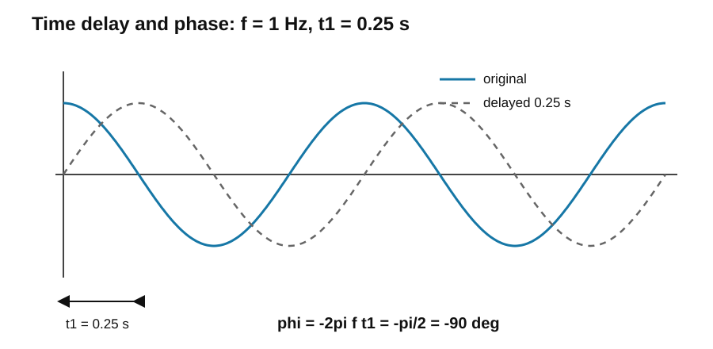

# 2. 주파수·각주파수·위상

## 2.1 주파수(Frequency)

주파수 $f$는 **1초 동안 같은 파형이 반복되는 횟수**임. 단위는 Hz를 사용함.

$$
1\,\mathrm{Hz}=1\text{회/s}
$$

주기와 주파수의 관계는 서로 역수임.

$$
f=\frac{1}{T}
$$

$$
T=\frac{1}{f}
$$

따라서 주파수가 높아질수록 한 주기에 걸리는 시간은 짧아짐.

### 1 Hz와 2 Hz 비교

$$
f_1=1\,\mathrm{Hz}\Rightarrow T_1=1\,\mathrm{s}
$$

$$
f_2=2\,\mathrm{Hz}\Rightarrow T_2=0.5\,\mathrm{s}
$$

2 Hz 신호는 1 Hz 신호와 비교하여 다음 특성을 가짐.

- 주기가 절반임.
- 1초 동안 반복되는 횟수가 두 배임.
- 시간에 따른 변화 속도가 더 빠름.

---

## 2.2 각주파수(Angular Frequency)

각주파수 $\omega$는 주파수를 초당 반복 횟수가 아니라 **초당 진행되는 라디안 각도**로 나타낸 값임.

한 주기는 원운동에서 한 바퀴이므로

$$
1\text{주기}=2\pi\,\mathrm{rad}
$$

임.

따라서

$$
\omega=2\pi f
$$

또는

$$
\omega=\frac{2\pi}{T}
$$

가 됨.

전체 관계는 다음과 같음.

$$
\omega=\frac{2\pi}{T}=2\pi f
$$

$$
T=\frac{2\pi}{\omega}=\frac{1}{f}
$$

$$
f=\frac{1}{T}=\frac{\omega}{2\pi}
$$

- $f$ : 1초에 몇 바퀴 반복하는지 나타냄.
- $\omega$ : 1초에 몇 rad만큼 진행하는지 나타냄.

주파수는 신호의 시간적 변화 속도와 관련됨. 주파수가 높을수록 같은 시간 동안 더 많은 주기를 진행하므로 파형이 더 빠르게 변함. 빠른 시간 변화를 보이는 신호에는 상대적으로 높은 주파수 성분이 포함됨.

---

## 2.3 시간 지연과 위상

정현파

$$
x(t)=A\cos(2\pi ft)
$$

를 $t_1$만큼 지연시키면

$$
x(t-t_1)=A\cos\left[2\pi f(t-t_1)\right]
$$

임.

괄호를 전개하면

$$
A\cos(2\pi ft-2\pi ft_1)
$$

이고, 일반적인 정현파 식

$$
x(t)=A\cos(2\pi ft+\phi)
$$

와 비교하면

$$
\phi=-2\pi ft_1
$$

임.

$T=1/f$이므로

$$
\phi=-\frac{2\pi t_1}{T}
$$

로도 표현 가능함.

시간 지연이므로 위상에는 음의 부호가 붙음.

- 시간 지연 → 음의 위상
- 시간 선행 → 양의 위상

위상은 시간 그 자체가 아니라 각도 또는 rad로 나타내는 양임.

---

## 2.4 같은 시간 지연과 주파수의 관계

위상 관계

$$
\phi=-2\pi ft_1
$$

에서 동일한 시간 지연 $t_1$을 적용하더라도 주파수 $f$가 달라지면 위상차 역시 달라짐.

첨부 자료와 같이

$$
t_1=0.25\,\mathrm{s}
$$

로 두면 다음과 같음.

### 1 Hz 신호

$$
T=1\,\mathrm{s}
$$

$$
\phi=-2\pi(1)(0.25)=-\frac{\pi}{2}
$$

즉, $-90^\circ$의 위상 지연이 발생함.

### 2 Hz 신호

$$
T=0.5\,\mathrm{s}
$$

$$
\phi=-2\pi(2)(0.25)=-\pi
$$

즉, $-180^\circ$의 위상 지연이 발생함.

따라서 같은 0.25 s 지연에서

- 1 Hz → $-90^\circ$
- 2 Hz → $-180^\circ$

가 됨.

동일한 시간 지연에서는 주파수가 높을수록 위상차의 크기가 커짐. 즉, 고주파 신호일수록 작은 시간 지연에도 더 큰 위상 변화가 발생함.

위상은 정현파의 모양이나 진폭을 변화시키지 않고, 시간축에서 파형의 위치만 변화시킴.
